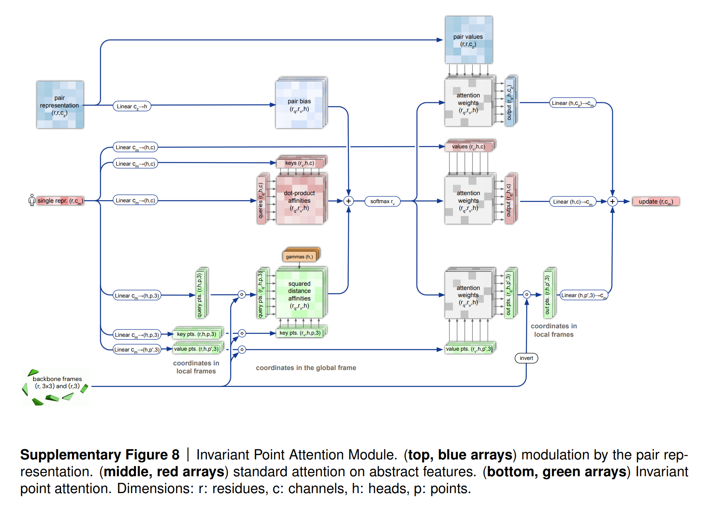

# Invariant Attention [](https://twitter.com/intent/tweet?text=Wow:&url=https%3A%2F%2Fgithub.com%2FRishit-dagli%2FInvariant-Attention)


[](https://github.com/Rishit-dagli/Invariant-Attention/actions/workflows/tests.yml)
[](https://github.com/Rishit-dagli/Invariant-Attention/actions/workflows/python-publish.yml)
[](https://github.com/psf/black)
[](https://colab.research.google.com/github/Rishit-dagli/Invariant-Attention/blob/main/example/invariant-attention-example.ipynb)


[](https://github.com/Rishit-dagli/Invariant-Attention/stargazers)
[](https://github.com/Rishit-dagli)
[](https://twitter.com/intent/follow?screen_name=rishit_dagli)

Invariant Point Attention which was used in the structure module of Alphafold2 from the paper [Highly accurate protein structure prediction with AlphaFold](https://www.nature.com/articles/s41586-021-03819-2#Abs1) for coordinate refinement. Invariant Point Attention is a form of attention that acts on a set of frames and is invariant under global Euclidean transformations on said frames.

This repository also includes Invariant Point Attention-based transformer block, which is an Invariant Point Attention followed by a feedforward



## Installation

Run the following to install:

```shell
pip install invariant-attention
```

## Developing invariant-attention

To install `invariant-attention`, along with tools you need to develop and test, run the following in your virtualenv:

```sh
git clone https://github.com/Rishit-dagli/invariant-attention.git
# or clone your own fork

cd invariant-attention
pip install -e .[dev]
```

To run rank and shape tests run any of the following:

```py
pytest invariant_attention --verbose
```

## Usage

Running a standalone attention block, we can also use this module without the pairwise representations:

```python
attn = InvariantPointAttention(
    dim=64,  # single (and pairwise) representation dimension
    heads=8,  # number of attention heads
    scalar_key_dim=16,  # scalar query-key dimension
    scalar_value_dim=16,  # scalar value dimension
    point_key_dim=4,  # point query-key dimension
    point_value_dim=4,  # point value dimension
)

single_repr = tf.random.normal((1, 256, 64))  # (batch x seq x dim)
pairwise_repr = tf.random.normal((1, 256, 256, 64))  # (batch x seq x seq x dim)
mask = tf.ones((1, 256), dtype=tf.bool)  # # (batch x seq)

rotations = repeat(
    tf.eye(3), "... -> b n ...", b=1, n=256
)
translations = tf.zeros((1, 256, 3))

attn_out = attn(
    single_repr,
    pairwise_repr,
    rotations=rotations,
    translations=translations,
    mask=mask,
) # (1, 256, 64)
```

Running an `IPABlock` (Invariant Point Attention Block) which is an IPA followed by a feedforward and has normalization layers:

```python
block = IPABlock(
    dim=64,
    heads=8,
    scalar_key_dim=16,
    scalar_value_dim=16,
    point_key_dim=4,
    point_value_dim=4,
)

seq = tf.random.normal((1, 256, 64))
pairwise_repr = tf.random.normal((1, 256, 256, 64))
mask = tf.ones((1, 256), dtype=tf.bool)

rotations = repeat(tf.eye(3), "... -> b n ...", b=1, n=256)
translations = tf.zeros((1, 256, 3))

block_out = block(
    seq,
    pairwise_repr=pairwise_repr,
    rotations=rotations,
    translations=translations,
    mask=mask,
)

updates = tf.keras.layers.Dense(6)(block_out)
quaternion_update, translation_update = tf.split(
    updates, num_or_size_splits=2, axis=-1
)  # (1, 256, 3), (1, 256, 3)
```

Running an `IPATransformer` which is a stack of `IPABlock` and feedforward layers:

```python
seq = tf.random.normal((1, 256, 32))
pairwise_repr = tf.random.normal((1, 256, 256, 32))
mask = tf.ones((1, 256), dtype=tf.bool)
translations = tf.zeros((1, 256, 3))

model = IPATransformer(
    dim=32,
    depth=2,
    num_tokens=None,
    predict_points=False,
    detach_rotations=True,
)

outputs = model(
    single_repr=seq,
    translations=translations,
    quaternions=tf.random.normal((1, 256, 4)),
    pairwise_repr=pairwise_repr,
    mask=mask,
) # (1, 256, 32), (1, 256, 3), (1, 256, 4)
```

## Want to Contribute 🙋‍♂️?

Awesome! If you want to contribute to this project, you're always welcome! See [Contributing Guidelines](CONTRIBUTING.md). You can also take a look at [open issues](https://github.com/Rishit-dagli/invariant-attention/issues) for getting more information about current or upcoming tasks.

## Want to discuss? 💬

Have any questions, doubts or want to present your opinions, views? You're always welcome. You can [start discussions](https://github.com/Rishit-dagli/invariant-attention/discussions).


## Citation

```bibtex
@article{jumper2021highly,
  title={Highly accurate protein structure prediction with AlphaFold},
  author={Jumper, John and Evans, Richard and Pritzel, Alexander and Green, Tim and Figurnov, Michael and Ronneberger, Olaf and Tunyasuvunakool, Kathryn and Bates, Russ and {\v{Z}}{\'\i}dek, Augustin and Potapenko, Anna and others},
  journal={Nature},
  volume={596},
  number={7873},
  pages={583--589},
  year={2021},
  publisher={Nature Publishing Group}
}
```

## License

```
Copyright 2022 Rishit Dagli

Licensed under the Apache License, Version 2.0 (the "License");
you may not use this file except in compliance with the License.
You may obtain a copy of the License at

    http://www.apache.org/licenses/LICENSE-2.0

Unless required by applicable law or agreed to in writing, software
distributed under the License is distributed on an "AS IS" BASIS,
WITHOUT WARRANTIES OR CONDITIONS OF ANY KIND, either express or implied.
See the License for the specific language governing permissions and
limitations under the License.
```